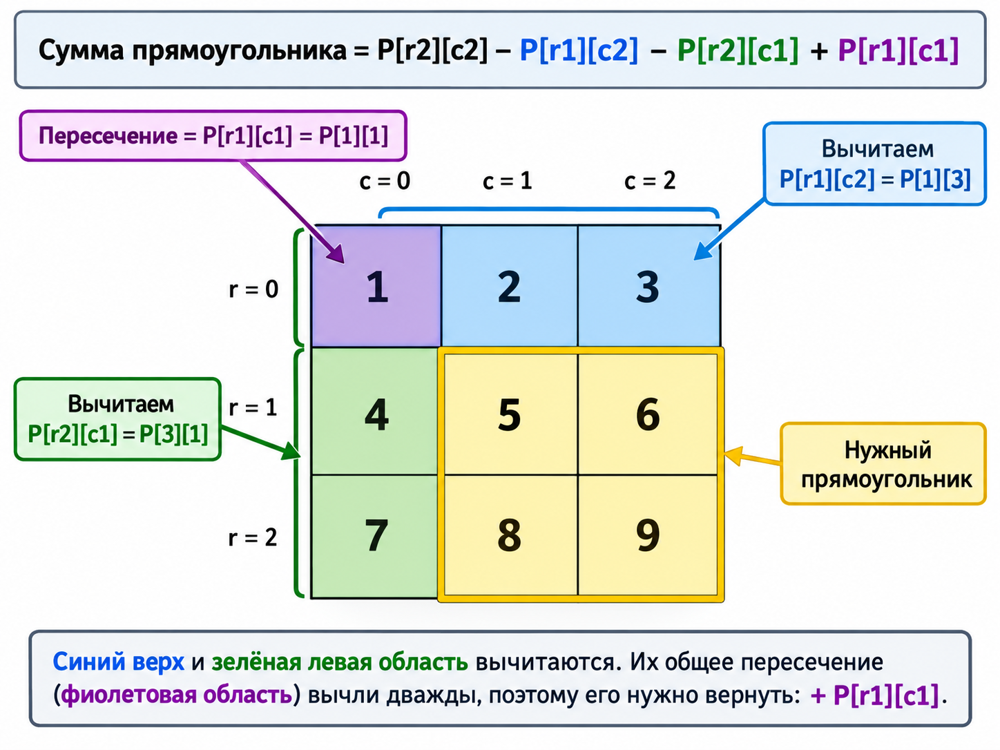
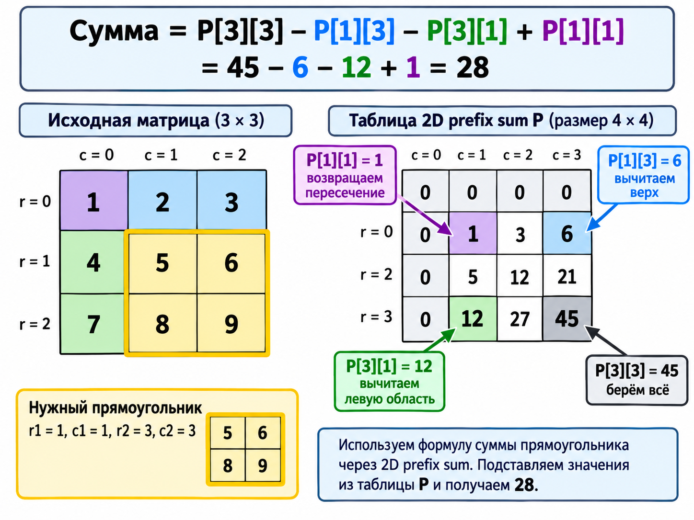

# Prefix Sum

## Overview and learning goals

Introduced: 2026-09-28. Understand how cumulative totals turn a contiguous range into a difference of two boundaries. Recognize range-query, exact-sum counting, and balanced-subarray problems. Choose what to store about previous totals based on whether the question asks for a count or a length.

## Core idea and mental model

Think of an odometer: distance over a trip is the final reading minus the starting reading.

Define `prefix[i]` as the sum of the first `i` elements, excluding element `i`:

- `prefix[0] = 0`: the empty prefix.
- `prefix[i + 1] = prefix[i] + nums[i]`.
- The sum of the half-open interval `[l, r)` is `prefix[r] - prefix[l]`.
- The sum of inclusive indices `[l, r]` is `prefix[r + 1] - prefix[l]`.

The invariant is about a boundary between elements, not an element's index. An array of length `n` has `n + 1` prefix boundaries. Negative values do not break subtraction; they do mean totals need not increase.

## Recognition clues

- Many sum queries over an unchanged array.
- A contiguous subarray must have a given total, including when negative values occur.
- A balance condition can be expressed as a zero sum after transforming contributions.

## Easy foundation

```text
nums:       [3, -2, 5, 1]
prefix:  [0, 3,  1, 6, 7]
boundary: 0  1   2  3  4
```

Inclusive range `[1, 2]` contains `[-2, 5]` and sums to `prefix[3] - prefix[1] = 6 - 3 = 3`. The shared earlier elements cancel.

The most common beginner mistake is mixing inclusive element indices with exclusive prefix boundaries. Say: **through the right endpoint, before the left endpoint**.

### Java solution: range sums

Build the prefix array once, then reuse it for all queries. `sumRange(left, right)` uses inclusive element indices; assume `0 <= left <= right < nums.length`. All examples below assume non-null inputs, valid indices, and totals that fit in `long`. They preserve the input arrays.

```java
final class RangeSum {
    private final long[] prefix;

    public RangeSum(int[] nums) {
        prefix = new long[nums.length + 1];
        for (int i = 0; i < nums.length; i++) {
            prefix[i + 1] = prefix[i] + nums[i];
        }
    }

    public long sumRange(int left, int right) {
        return prefix[right + 1] - prefix[left];
    }
}
```

Example: `new RangeSum(new int[]{3, -2, 5, 1}).sumRange(1, 2)` returns `3`.

Construction: O(n) time and O(n) space. Each query: O(1) time and O(1) additional space. `long` prevents overflow when a sum exceeds the `int` range.

## Medium application archetypes

### Count contiguous subarrays with sum k

The boundaries are unknown, and every matching subarray matters. The clue remains a sum of a contiguous segment. At a current boundary with total `s`, a valid earlier total must be `s - k`, because `s - earlier = k`.

Store frequencies of earlier totals. A set loses multiplicity: identical totals at different boundaries represent different possible starts. Seed the empty prefix with frequency one. Count matching earlier boundaries before recording the current boundary, so a zero target does not count an empty subarray.

For `[1, -1, 1]` with target `1`, the answer is three: the first element, the last element, and the entire array. Before the final boundary, total zero has appeared twice.

Ordinary sum-based shrinking windows fail with signed values: extending a window can decrease its sum, and shrinking it can increase its sum. For `[4, -1]`, target `3`, dropping `4` as soon as the total exceeds `3` loses the valid whole array.

### Java solution: count subarrays with sum k

The method counts nonempty subarrays. Here `k` is an `int`; running totals, map keys, frequencies, and the answer use `long` because they can exceed the `int` range.

```java
import java.util.HashMap;
import java.util.Map;

final class SubarraySumCounter {
    public long countSubarrays(int[] nums, int k) {
        Map<Long, Long> frequencies = new HashMap<>(); // сколько есть позиций из которых в текущую сумму результат будет k
        frequencies.put(0L, 1L); // Empty prefix: one possible start.
        long sum = 0;
        long count = 0;

        for (int value : nums) {
            sum += value;
            // sum - k - получим prevPrefixSum из которой текущая сумма станет = k, те в prevPrefixSum - храним сколько подмассивчикво нас в него приведут
            count += frequencies.getOrDefault(sum - k, 0L);
            frequencies.put(sum, frequencies.getOrDefault(sum, 0L) + 1);// это мама этих самых prevPrefixSum,
            // те в каждую prefixSum(тут sum) мы можем много каким подмассивом попасть(всегда мотонным правда)
            // тут мы их просто считаем сколько их всего
            // sum - k узнаем из какого prefixSum мы можем сюда попасть или не из какого - ничего страшного 0 вернется
            // если не 0 то он означает следующее: есть подмассив с разностью prefixSum = k
            // разность prefixSum значит сумма элеметнов подмассива = k
            // а сколько их таких к текущему моменту frequencies.getOrDefault(sum - k, 0L) ?
            // пусть далше +1 и -1 элементы на сколько это увеличит счетчики, увеличит на count = count + frequencies.getOrDefault(sum, 0L) + 1)
            // тк права граница сдвинулась и получились все другие подмассивы + они же но с другой правой границей(более длинные в право)
            // это разные массивы каждый раз когда prefixSum - k совпадает с той что уже видели, значит все ранее виденные массивы
            // можно превратить в такие же но более длинные в право занчит count +=  frequencies.getOrDefault(sum - k, 0L)
        }
        return count;
    }
}
```

Example: `new SubarraySumCounter().countSubarrays(new int[]{1, -1, 1}, 1)` returns `3`. The successive contributions to the answer are `1`, `0`, and `2`. An empty array returns `0`.

Expected O(n) time and O(n) auxiliary space. The lookup must precede insertion: for `[0]` and `k = 0`, there is one valid subarray, not two.

### Longest balanced binary subarray

The request is equal counts of zeros and ones rather than an explicit sum. Treat a zero as contribution `-1` and a one as `+1`, without needing to mutate the input. A balanced segment has sum zero, so its boundary totals are equal.

Store the earliest boundary for each total. At boundary `j`, an earlier equal total at `i` gives length `j - i`. Overwriting an early boundary loses a potentially longer answer. A frequency map answers a counting question; it does not identify the farthest matching start.

### Java solution: longest balanced binary subarray

Assume every input value is `0` or `1`. Return the maximum length, or `0` if no nonempty balanced subarray exists. Store prefix boundaries, so the empty prefix is at boundary `0`, not at element index `-1`.

```java
import java.util.HashMap;
import java.util.Map;

final class BalancedBinarySubarray {
    public int longestBalanced(int[] nums) {
        Map<Integer, Integer> firstBoundary = new HashMap<>();
        firstBoundary.put(0, 0);
        int balance = 0;
        int longest = 0;

        for (int i = 0; i < nums.length; i++) {
            balance += nums[i] == 0 ? -1 : 1;
            int boundary = i + 1;
            Integer first = firstBoundary.get(balance); // balance can be 1, 2, 3, 4
            // and later in the some point it begins decrementing 3, 2, 1
            // for 3 we see that firstBoundary already have value it means, that in prefix summ 1, 2, 3, 4, 3 - between 3,4,3 is balanced 4,3
            // as we value returned to previously saved one - means was enough 0 to return to previous value
            if (first == null) {
                firstBoundary.put(balance, boundary);
            } else {
                longest = Math.max(longest, boundary - first);
            }
        }
        return longest;
    }
}
```

Example: `new BalancedBinarySubarray().longestBalanced(new int[]{0, 1, 0, 1, 1})` returns `4`. Balance zero occurs at boundaries `0`, `2`, and `4`; keeping boundary `0` yields the longest distance `4 - 0`.

Expected O(n) time and O(n) auxiliary space. The balance is between `-n` and `n`, so `int` suffices. An empty array returns `0`.

### Rectangle sums in an unchanged grid

The one-dimensional range becomes a two-dimensional rectangle. The clue is repeated additive queries over fixed data. Store a prefix grid with an extra zero row and column. Subtract the region above and the region to the left, then add back their intersection, which was subtracted twice.

For half-open rectangle `[r1, r2) x [c1, c2)`, use `P[r2][c2] - P[r1][c2] - P[r2][c1] + P[r1][c1]`. Omitting the overlap correction gives wrong sums. Building a prefix grid takes O(rows * columns) time and space; each query takes O(1).

### Java solution: rectangle sums

Assume a nonempty rectangular matrix. Queries use half-open boundaries: `0 <= r1 <= r2 <= rows` and `0 <= c1 <= c2 <= columns`. A rectangle with zero height or width has sum zero.

```java
final class RectangleSum {
    private final long[][] prefix;

    public RectangleSum(int[][] matrix) {
        int rows = matrix.length;
        int columns = matrix[0].length;
        prefix = new long[rows + 1][columns + 1];
        for (int r = 0; r < rows; r++) {
            for (int c = 0; c < columns; c++) {
                prefix[r + 1][c + 1] = matrix[r][c]
                        + prefix[r][c + 1]
                        + prefix[r + 1][c]
                        - prefix[r][c];
            }
        }
    }

    public long sumRectangle(int r1, int c1, int r2, int c2) {
        return prefix[r2][c2]
                - prefix[r1][c2]
                - prefix[r2][c1]
                + prefix[r1][c1];
    }

    /** исходный        prefixSum 2D
     *                  0  0   0   0
     *  1  2  3         0  1   3   6
     *  4  5  6         0  5   12  21
     *  7  8  9         0  12  32  50
     *  
     *  как считаем префикс сумм 2D: p[i][j] = p[i+1][j] + p[i][j - 1] - p[i - 1][j - 1]
     *  в итоге в каждой ячейке сумма всего подмассива от 0,0 до i,j
     *  
     *  ответ такой: из нижнего правого вычитаем сумму левого квадрата от 0,0 до r2 c1 потом весь верхний от 0,0 до r1,с2
     *  все верхняя область и правая пересекаются поэтому нужно ее прибавить так как это пересечение дважды вычлось
     *  прибавляем r1 c1
     */
}
```


Example: `new RectangleSum(new int[][]{{1, 2, 3}, {4, 5, 6}}).sumRectangle(0, 1, 2, 3)` returns `16`: it includes `2 + 3 + 5 + 6`.

During construction, the upper and left prefixes overlap, so subtract their intersection once. During a query, both subtractions remove the intersection, so add it back once. Construction: O(rows * columns) time and space; each query: O(1) time and O(1) additional space.

## Hard overview: shortest subarray with sum at least k

With signed values, the task asks for an inequality and a shortest distance, rather than an exact match. Prefix subtraction still expresses the condition, but an ordinary frequency-map lookup cannot answer which earlier totals are small enough and yield the shortest segment.

A monotonic deque can retain useful candidate boundaries and discard dominated ones. This combines prefix sums with an ordered-candidate technique to obtain O(n) time. The totals themselves are not assumed sorted. Recognize **signed values + contiguous sum + threshold + shortest length**. The complete implementation below is an advanced reference; independent mastery of the deque is not required to finish the basic Prefix Sum block.

### Java solution: shortest subarray with sum at least k

Return the length of the shortest nonempty qualifying subarray, or `-1` if none exists. Assume a positive `int` target `k`; negative array elements are allowed.

The deque stores boundary indices in increasing order, and their prefix totals are strictly increasing. At a new boundary `right`:

1. If the front gives a sufficient sum, record its length and remove it. Any future endpoint would only make a subarray with that same start longer. Continue checking: the next start may give an even shorter valid subarray.
2. Remove a back boundary if its total is at least the current total. The current boundary is later and has a no-larger total, so for every future endpoint it gives a shorter subarray with a no-smaller sum. The removed candidate can never be better.
3. Append the current boundary for future endpoints. Querying before appending prevents choosing an empty subarray.

```java
import java.util.ArrayDeque;
import java.util.Deque;

final class ShortestThresholdSubarray {
    public int shortestSubarray(int[] nums, int k) {
        int n = nums.length;
        long[] prefix = new long[n + 1];
        for (int i = 0; i < n; i++) {
            prefix[i + 1] = prefix[i] + nums[i];
        }

        Deque<Integer> candidates = new ArrayDeque<>();
        int shortest = -1;
        for (int right = 0; right <= n; right++) {
            while (!candidates.isEmpty()
                    && prefix[right] - prefix[candidates.peekFirst()] >= k) {
                int length = right - candidates.removeFirst();
                shortest = shortest == -1 ? length : Math.min(shortest, length);
            }
            while (!candidates.isEmpty()
                    && prefix[candidates.peekLast()] >= prefix[right]) {
                candidates.removeLast();
            }
            candidates.addLast(right);
        }
        return shortest;
    }
}
```

Example: `new ShortestThresholdSubarray().shortestSubarray(new int[]{2, -1, 2}, 3)` returns `3`. Its prefix totals are `[0, 2, 1, 3]`. At boundary `2`, total `1` removes boundary `1` with total `2` from the back: the newer start is better for future endpoints. At boundary `3`, the front boundary `0` gives sum `3` and length `3`.

For `[1, 2]` with `k = 2`, the answer is `1`: the first `while` checks multiple starts at the same endpoint. For `[1, -1]` with `k = 2`, the answer is `-1`.

O(n) time and O(n) auxiliary space. Each boundary enters the deque once and leaves at most once; the nested `while` loops do not imply quadratic time.

## Common mistakes and contrasts

- Forgetting the empty prefix loses ranges that start at index zero.
- Confusing counts, earliest positions, and membership: choose map values for the requested output.
- Inserting the current boundary too soon can count an empty interval.
- Assuming prefix totals increase when inputs include negatives.
- Ignoring overflow: bound both the running sum and the answer; use `long` when necessary. There can be `n * (n + 1) / 2` nonempty subarrays.
- Prefix preprocessing does not make enumeration of all O(n^2) intervals linear.
- Sliding window needs a usable rule for moving boundaries; prefix subtraction itself needs no positive-value assumption.
- Frequent updates invalidate later stored totals. Basic static prefixes are then a poor fit; dynamic range structures are a later topic.
- Range minima cannot generally be recovered by subtracting prefix minima.

## Implementation checklist and learning hook

**Boundary, difference, memory.**

1. Restate the output contract: sum, count, or length.
2. Define exactly what each prefix boundary includes.
3. Write the equation connecting the two boundaries.
4. Choose an array, frequencies, or earliest positions as needed.
5. Include the empty prefix and check lookup/update order.
6. Check numeric bounds, input preservation, and complexity.

As a short recall exercise, derive a range sum from a small array without copying the formula, then explain what two equal prefix totals imply.

## Complexity

- Static array: O(n) preprocessing time and space; O(1) per query, O(n + q) total for q queries.
- Running total plus hash map: expected O(n) time and O(n) worst-case auxiliary space.
- A running total alone: O(1) space, but cannot answer arbitrary past-range queries without additional stored information.

## Repository connections

- Minimum Size Subarray Sum, practiced 2026-09-22: contrast its positive-input window reasoning with signed-input exact-sum problems.
- Max Consecutive Ones III, practiced 2026-09-28: its zero count changes predictably as boundaries move; a signed sum does not.
- The earlier mixed-session log mentions an unattempted range-sum workspace, but its files were absent when this lesson began. It is not evidence of completed prefix-sum practice.
- First coding assignment for this block follows the initial understanding check.
